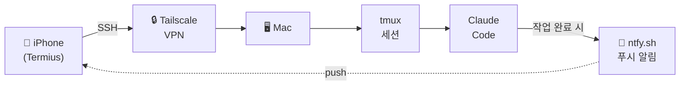

# 모바일 Claude Code 세팅 가이드

> **[English Version](./README.md)**

아이폰에서 SSH로 Mac에 접속하여 Claude Code를 사용하기 위한 환경 구성.

## 구성도



## 구성 요소 소개

| 도구 | 역할 | 왜 필요한지 |
|------|------|-------------|
| **Tailscale** | VPN | 포트포워딩/방화벽 없이 어디서든 Mac에 접속. 카페, 지하철, 호텔 와이파이 어디든 |
| **tmux** | 세션 유지 | SSH 끊겨도 Claude Code가 계속 돌아감 (아래 상세 설명) |
| **Mosh** | 연결 안정성 | SSH 위에 올라가는 프로토콜. 셀룰러↔와이파이 전환, 일시적 신호 끊김에도 연결 유지. 셸에서 한글 입력이 깨지지만, Claude Code에서도 복붙이 필요하므로 연결 안정성을 위해 사용 |
| **Termius** | SSH 클라이언트 | 아이폰에서 터미널 접속하는 앱 |
| **ntfy** | 푸시 알림 | Claude Code가 입력 대기 중이면 폰에 알림 |

### tmux란?

tmux는 **터미널 안의 독립적인 가상 터미널**입니다.

일반 SSH:
```
iPhone → SSH 연결 → Claude Code
            ↑
      연결 끊기면 Claude Code도 죽음
```

tmux 사용:
```
iPhone → SSH 연결 → tmux → Claude Code
            ↑                  ↑
      연결 끊겨도          얘는 계속 살아있음
```

SSH는 tmux를 **들여다보는 창문**일 뿐입니다. 창문을 닫아도(SSH 끊김) 방 안(tmux)은 그대로입니다. 다시 접속하면 이어서 볼 수 있습니다.

이게 없으면 지하철에서 신호 한 번 끊길 때마다 Claude Code를 처음부터 다시 시작해야 합니다.

---

## 사전 준비

### Mac
- Homebrew가 설치된 macOS (`/opt/homebrew`)
- tmux 설치: `brew install tmux`
- Mosh 설치 (선택): `brew install mosh`

### iPhone (App Store에서 설치)
- **Termius** — SSH 클라이언트 (무료)
- **Tailscale** — VPN 접속용
- **ntfy** — 푸시 알림 수신용

### 계정
- Tailscale 계정 (Google/GitHub/Apple 로그인) — Mac과 iPhone에서 같은 계정 사용

---

## 설치 가이드

### 1. SSH (원격 로그인) 활성화

```bash
# 상태 확인
sudo systemsetup -getremotelogin

# 활성화 ("Full Disk Access" 에러 나면 아래 명령어 사용)
sudo launchctl load -w /System/Library/LaunchDaemons/ssh.plist
```

확인:
```bash
nc -z localhost 22 && echo "SSH 열림" || echo "SSH 닫힘"
```

### 2. Tailscale 설치

```bash
brew install --cask tailscale
```

> **참고**: sudo가 필요하므로 Claude Code에서 실패하면 터미널에서 직접 실행.

- Tailscale 앱 실행 후 로그인
- iPhone에도 Tailscale 앱 설치 (App Store) → 같은 계정으로 로그인
- Tailscale IP 확인:

```bash
tailscale ip
# 출력: 100.x.x.x (Termius에 이 IP 입력)
```

### 3. Mosh 설치 (선택사항)

```bash
brew install mosh
```

> Mosh 사용 시 셸에서 한글 입력이 깨지지만, Claude Code 자체도 복붙이 필요하므로 큰 차이 없음.
> 연결 안정성이 올라가므로 사용 권장.

### 4. tmux 설정

`~/.tmux.conf` 작성:

```conf
# 256 색상
set -g default-terminal "screen-256color"

# 스크롤백 버퍼
set -g history-limit 50000

# 마우스 지원 (Termius에서 스크롤 가능)
set -g mouse on

# 연결 끊겨도 세션 유지
set -g destroy-unattached off

# 상태바 간소화 (모바일 좁은 화면용)
set -g status-left-length 20
set -g status-right '%H:%M'
```

### 5. ntfy 설정 (푸시 알림)

#### iPhone
1. App Store에서 **ntfy** 설치
2. 토픽 구독: `woojin-claude-{호스트이름}`
   - 호스트이름 확인: `hostname -s` (예: `Woojinui-Macmini`)
   - 전체 토픽: `woojin-claude-Woojinui-Macmini`

#### Mac
`~/.claude/settings.json`에 Notification hook 추가:

```json
{
  "hooks": {
    "Notification": [
      {
        "matcher": "",
        "hooks": [
          {
            "type": "command",
            "command": "if [ -n \"$SSH_CONNECTION\" ]; then MSG=$(cat | jq -r '.message // \"Claude Code 알림\"'); curl -s -d \"$MSG\" ntfy.sh/woojin-claude-$(hostname -s) > /dev/null; fi",
            "timeout": 5
          }
        ]
      }
    ]
  }
}
```

- `$SSH_CONNECTION` 체크: SSH 접속일 때만 푸시 발송 (로컬 터미널에서는 알림 안 옴)
- `permission_prompt` (퍼미션 요청) 및 `idle_prompt` (60초 이상 대기) 시 발동
- 대화 중에는 알림이 오지 않아 스팸 방지

테스트:
```bash
curl -d "테스트" "ntfy.sh/woojin-claude-$(hostname -s)"
# iPhone에 푸시 알림이 와야 함
```

### 6. Termius 설정 (iPhone)

1. 새 호스트 추가:
   - **Hostname**: Tailscale IP (`100.x.x.x`)
   - **Port**: 22
   - **Username**: Mac 사용자 이름
   - **Password**: Mac 로그인 비밀번호
   - **Mosh**: ON
   - **Mosh Command**: `/opt/homebrew/bin/mosh-server new -s -c 256 -l LANG=en_US.UTF-8`

---

## Mac 상시 준비 상태

설치가 끝나면 원격에서 아무 때나 접속할 수 있도록 Mac을 준비해둡니다:

- **전원 켜져 있을 것** — 잠자기(sleep)는 OK, 종료(shutdown)는 안 됨
- **잠자기 중에도 네트워크 유지** — `시스템 설정 → 에너지 → 네트워크 접근으로 깨우기` 활성화
- **Tailscale 실행 중** — 로그인 항목에 추가해두면 부팅 시 자동 실행됨
- **SSH 활성화** — 한 번 켜두면 재부팅해도 유지됨

> Mac mini나 데스크탑은 항상 켜두면 되고, MacBook은 덮개를 닫아도 잠자기 상태에서 네트워크가 유지되므로 접속 가능합니다 (다만 배터리 소모 주의).

---

## 사용법

### `tc` 명령어

`~/.zshrc`에 추가하면 모든 시나리오를 `tc` 하나로 처리합니다:

```bash
# tmux + Claude Code: attach if session exists, create + start claude if not
tc() {
  tmux attach -t claude 2>/dev/null || { tmux new -s claude -d && tmux send-keys -t claude "claude" Enter && tmux attach -t claude; }
}
```

동작 흐름:
1. `tmux attach -t claude` — "claude" 세션이 있으면 붙기
2. `2>/dev/null` — 세션 없을 때 에러 메시지 숨기기
3. `||` — 위가 실패하면 (세션 없으면) 아래 실행
4. `tmux new -s claude -d` — 백그라운드에서 새 세션 생성
5. `tmux send-keys ... "claude" Enter` — 생성된 세션에 `claude` 명령어 전송
6. `tmux attach -t claude` — 세션에 붙기

### 시나리오 1: Mac에서 시작, 아이폰에서 이어서

**Mac (외출 전):**
```bash
tc                       # tmux + Claude Code 시작
# 작업 지시 후 자리 비움
# detach 안 해도 됨 — 덮개 닫거나 그냥 나가면 됨
```

**iPhone (이동 중):**
```bash
# 1. Termius 열고 호스트 접속
tc                       # 기존 세션에 자동으로 붙음
# ntfy 푸시 알림: Claude가 입력 대기 60초 넘으면 알림 옴
```

### 시나리오 2: 아이폰에서 바로 시작

```bash
# 1. Termius 열고 호스트 접속
tc                       # tmux + Claude Code 자동 시작
# 한글 입력: 메모앱에서 타이핑 후 복사붙여넣기
```

### 시나리오 3: 연결 끊긴 후 재접속

```bash
# 연결 끊김 (지하철, 와이파이 전환 등)
# 1. Termius 다시 열고 호스트 접속
tc                       # 세션 살아있으면 자동으로 붙음
```

### 종료하기

```bash
# Claude Code 안에서:
/exit                    # 1. Claude Code 종료 (또는 Ctrl+C)

# 셸로 돌아온 후:
exit                     # 2. tmux 세션 종료 (세션 삭제됨)
# 또는: Ctrl-b d 로 detach (세션 유지, 나중에 다시 붙기 가능)
```

### tmux 단축키 모음

| 동작 | 키 |
|------|-----|
| Detach (세션 유지하고 나가기) | `Ctrl-b d` |
| 위로 스크롤 | `Ctrl-b [` 후 방향키, `q`로 나가기 |
| 세션 목록 | `tmux ls` |
| 세션 삭제 | `tmux kill-session -t claude` |
| 새 윈도우 | `Ctrl-b c` |
| 윈도우 전환 | `Ctrl-b n` (다음) / `Ctrl-b p` (이전) |

---

## 알려진 문제

| 문제 | 원인 | 해결책 |
|------|------|--------|
| Claude Code에서 한글 입력 깨짐 | [iOS IME 버그](https://github.com/anthropics/claude-code/issues/15705) | 메모앱에서 한글 타이핑 후 복사붙여넣기 |
| Mosh 사용 시 셸 한글 입력 깨짐 | Mosh의 locale/IME 처리 문제 | 어차피 Claude Code도 복붙 필요하므로 Mosh ON 유지, 한글은 복붙 |
| `mosh-server: command not found` | SSH 세션에서 Homebrew 경로 누락 | Termius에서 서버 경로를 `/opt/homebrew/bin/mosh-server`로 지정 |
| SSH `connection refused` | 원격 로그인 미활성화 | `sudo launchctl load -w /System/Library/LaunchDaemons/ssh.plist` |
| `brew install --cask tailscale` 실패 | sudo 필요 | 터미널에서 직접 실행 |

## 테스트 환경

- macOS 26.3 (Apple Silicon, Mac mini)
- tmux 3.6a
- Mosh 1.4.0
- Termius (iOS, 무료 플랜)
- Tailscale 1.94.2
- 작성일: 2026-02-22
