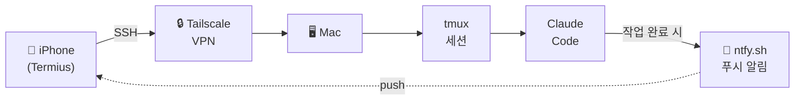

# 모바일 Claude Code 세팅 가이드

> **[English Version](./README.md)**

아이폰에서 SSH로 Mac에 접속하여 Claude Code를 사용하기 위한 환경 구성.

## 구성도



## 사전 준비

### Mac
- Homebrew가 설치된 macOS (`/opt/homebrew`)
- tmux 설치: `brew install tmux`

### iPhone (App Store에서 설치)
- **Termius** — SSH 클라이언트 (무료)
- **Tailscale** — VPN 접속용
- **ntfy** — 푸시 알림 수신용

### 계정
- Tailscale 계정 (Google/GitHub/Apple 로그인) — Mac과 iPhone에서 같은 계정 사용

## 1. SSH (원격 로그인) 활성화

```bash
# 상태 확인
sudo systemsetup -getremotelogin

# 활성화 ("Full Disk Access" 에러 나면 아래 명령어 사용)
sudo launchctl load -w /System/Library/LaunchDaemons/ssh.plist
```

확인:
```bash
nc -z localhost 22 && echo "SSH 열림" || echo "SSH 닫힘"
```

## 2. Tailscale 설치

```bash
brew install --cask tailscale
```

> **참고**: sudo가 필요하므로 Claude Code에서 실패하면 터미널에서 직접 실행.

- Tailscale 앱 실행 후 로그인
- iPhone에도 Tailscale 앱 설치 (App Store) → 같은 계정으로 로그인
- Tailscale IP 확인:

```bash
tailscale ip
# 출력: 100.x.x.x (Termius에 이 IP 입력)
```

## 3. Mosh 설치 (선택사항)

```bash
brew install mosh
```

> **주의**: Mosh 사용 시 iOS에서 한글 입력이 깨짐. 일반 SSH를 사용하는 것을 권장.
> Mosh 경로 (필요 시): `/opt/homebrew/bin/mosh-server`

## 4. tmux 설정

`~/.tmux.conf` 작성:

```conf
# 256 색상
set -g default-terminal "screen-256color"

# 스크롤백 버퍼
set -g history-limit 50000

# 마우스 지원 (Termius에서 스크롤 가능)
set -g mouse on

# 연결 끊겨도 세션 유지
set -g destroy-unattached off

# 상태바 간소화 (모바일 좁은 화면용)
set -g status-left-length 20
set -g status-right '%H:%M'
```

## 5. ntfy 설정 (푸시 알림)

### iPhone
1. App Store에서 **ntfy** 설치
2. 토픽 구독: `woojin-claude-{호스트이름}`
   - 호스트이름 확인: `hostname -s` (예: `Woojinui-Macmini`)
   - 전체 토픽: `woojin-claude-Woojinui-Macmini`

### Mac
`~/.claude/settings.json`에 Notification hook 추가:

```json
{
  "hooks": {
    "Notification": [
      {
        "matcher": "",
        "hooks": [
          {
            "type": "command",
            "command": "if [ -n \"$SSH_CONNECTION\" ]; then MSG=$(cat | jq -r '.message // \"Claude Code 알림\"'); curl -s -d \"$MSG\" ntfy.sh/woojin-claude-$(hostname -s) > /dev/null; fi",
            "timeout": 5
          }
        ]
      }
    ]
  }
}
```

- `$SSH_CONNECTION` 체크: SSH 접속일 때만 푸시 발송 (로컬 터미널에서는 알림 안 옴)
- `permission_prompt` (퍼미션 요청) 및 `idle_prompt` (60초 이상 대기) 시 발동
- 대화 중에는 알림이 오지 않아 스팸 방지

테스트:
```bash
curl -d "테스트" "ntfy.sh/woojin-claude-$(hostname -s)"
# iPhone에 푸시 알림이 와야 함
```

## 6. Termius 설정 (iPhone)

1. 새 호스트 추가:
   - **Hostname**: Tailscale IP (`100.x.x.x`)
   - **Port**: 22
   - **Username**: Mac 사용자 이름
   - **Password**: Mac 로그인 비밀번호
   - **Mosh**: OFF (Mosh 켜면 한글 입력 깨짐)

## 사용법

### 세션 시작 (Mac에서):
```bash
tmux new -s claude
claude
# Ctrl-b d 로 detach (또는 그냥 나가도 됨)
```

### 아이폰에서 접속:
```bash
# Termius로 접속 후
tmux attach -t claude
# 기존 세션이 그대로 보임
```

### 연결 끊긴 후 재접속:
```bash
tmux attach -t claude
# tmux가 세션을 유지하므로 SSH 끊겨도 작업 상태 그대로
```

## 알려진 문제

| 문제 | 원인 | 해결책 |
|------|------|--------|
| Claude Code에서 한글 입력 깨짐 | [iOS IME 버그](https://github.com/anthropics/claude-code/issues/15705) | 메모앱에서 한글 타이핑 후 복사붙여넣기 |
| Mosh 사용 시 한글 입력 깨짐 | Mosh의 locale/IME 처리 문제 | Mosh OFF, 일반 SSH 사용 |
| `mosh-server: command not found` | SSH 세션에서 Homebrew 경로 누락 | Termius에서 서버 경로를 `/opt/homebrew/bin/mosh-server`로 지정 |
| SSH `connection refused` | 원격 로그인 미활성화 | `sudo launchctl load -w /System/Library/LaunchDaemons/ssh.plist` |
| `brew install --cask tailscale` 실패 | sudo 필요 | 터미널에서 직접 실행 |

## 테스트 환경

- macOS 26.3 (Apple Silicon, Mac mini)
- tmux 3.6a
- Mosh 1.4.0 (설치했으나 한글 문제로 미사용)
- Termius (iOS, 무료 플랜)
- Tailscale 1.94.2
- 작성일: 2026-02-22
