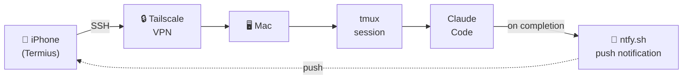

# Mobile Claude Code Setup Guide

> **[한국어 버전 (Korean)](./README.ko.md)**

Access Claude Code from iPhone via SSH (Tailscale + tmux + Termius + ntfy).

## Architecture



## Components

| Tool | Role | Why needed |
|------|------|------------|
| **Tailscale** | VPN | Access your Mac from anywhere without port forwarding or firewall config |
| **tmux** | Session persistence | Claude Code keeps running even if SSH disconnects (details below) |
| **Mosh** | Connection stability | Protocol on top of SSH. Survives cellular↔wifi switches and brief signal drops. Korean input breaks in shell, but since Claude Code also requires copy-paste for Korean, we use Mosh for connection stability |
| **Termius** | SSH client | Terminal app for iPhone |
| **ntfy** | Push notifications | Get alerted on your phone when Claude Code is waiting for input |

### Does Tailscale route all iPhone traffic through the VPN?

No — Tailscale uses **split tunneling** by default. Only traffic destined for Tailscale-registered devices (your Mac's `100.x.x.x` address) goes through the VPN. Everything else (YouTube, apps, etc.) goes directly as usual.

```
Regular internet traffic  →  direct (no VPN)
Mac access (100.x.x.x)   →  via Tailscale
```

The routing decision is a kernel-level IP lookup — nanosecond-scale per packet, the same work the OS already does for every packet. The only real battery cost is encryption, and that only kicks in when you're actually connected to your Mac.

### What is tmux?

tmux is an **independent virtual terminal** that runs inside your Mac.

Without tmux:
```
iPhone → SSH connection → Claude Code
              ↑
       disconnect = Claude Code dies
```

With tmux:
```
iPhone → SSH connection → tmux → Claude Code
              ↑                      ↑
       disconnect here         still running
```

SSH is just a **window** into tmux. Closing the window (SSH disconnect) doesn't affect the room (tmux). Reconnect anytime and pick up where you left off.

Without this, every signal drop on the subway means restarting Claude Code from scratch.

---

## Prerequisites

### Mac
- macOS with Homebrew (`/opt/homebrew`)
- tmux: `brew install tmux`
- Mosh (optional): `brew install mosh`

### iPhone (install from App Store)
- **Termius** — SSH client (free)
- **Tailscale** — VPN access
- **ntfy** — push notifications

### Account
- Tailscale account (Google/GitHub/Apple login) — use same account on both Mac and iPhone

---

## Installation

### 1. Enable SSH (Remote Login)

```bash
# Check status
sudo systemsetup -getremotelogin

# Enable (if "Full Disk Access" error, use launchctl instead)
sudo launchctl load -w /System/Library/LaunchDaemons/ssh.plist
```

Verify:
```bash
nc -z localhost 22 && echo "SSH OPEN" || echo "SSH CLOSED"
```

### 2. Install Tailscale

```bash
brew install --cask tailscale
```

> **Note**: Requires sudo. If it fails in Claude Code, run manually in terminal.

- Launch Tailscale app and log in
- Add to Login Items for auto-start on boot:

```bash
osascript -e 'tell application "System Events" to make login item at end with properties {path:"/Applications/Tailscale.app", hidden:false}'
```

- Install Tailscale on iPhone (App Store), log in with same account
- Get your Tailscale IP:

```bash
tailscale ip
# Output: 100.x.x.x (use this for Termius)
```

### 3. Install Mosh (Optional)

```bash
brew install mosh
```

> Mosh breaks Korean input in shell, but Claude Code also requires copy-paste for Korean anyway.
> Recommended for connection stability.

### 4. Configure tmux

Write `~/.tmux.conf`:

```conf
# 256 color
set -g default-terminal "screen-256color"

# Scrollback buffer
set -g history-limit 50000

# Mouse support (scroll in Termius)
set -g mouse on

# Keep session alive when detached
set -g destroy-unattached off

# Minimal status bar (mobile-friendly)
set -g status-left-length 20
set -g status-right '%H:%M'
```

### 5. Configure ntfy (Push Notifications)

#### iPhone
1. Install **ntfy** from App Store
2. Subscribe to topic: `woojin-claude-{hostname}`
   - Check hostname: `hostname -s` (e.g., `Woojinui-Macmini`)
   - Full topic: `woojin-claude-Woojinui-Macmini`

#### Mac
Add Notification hook to `~/.claude/settings.json`:

```json
{
  "hooks": {
    "Notification": [
      {
        "matcher": "",
        "hooks": [
          {
            "type": "command",
            "command": "if [ -n \"$SSH_CONNECTION\" ]; then MSG=$(cat | jq -r '.message // \"Claude Code 알림\"'); curl -s -d \"$MSG\" ntfy.sh/woojin-claude-$(hostname -s) > /dev/null; fi",
            "timeout": 5
          }
        ]
      }
    ]
  }
}
```

- `$SSH_CONNECTION` check: only sends push when connected via SSH (no alerts on local terminal)
- Triggers on `permission_prompt` (permission request) and `idle_prompt` (idle 60+ seconds)
- No notification spam during active conversation

Test:
```bash
curl -d "test" "ntfy.sh/woojin-claude-$(hostname -s)"
# iPhone should receive push notification
```

### 6. Termius Setup (iPhone)

1. New Host:
   - **Hostname**: Tailscale IP (`100.x.x.x`)
   - **Port**: 22
   - **Username**: your mac username
   - **Password**: Mac login password
   - **Mosh**: ON
   - **Mosh Command**: `/opt/homebrew/bin/mosh-server new -s -c 256 -l LANG=en_US.UTF-8`

> **Note**: `/opt/homebrew` is for Apple Silicon Macs. Intel Macs use `/usr/local` — replace accordingly.

---

## Keeping Your Mac Ready

Once installation is complete, keep your Mac ready for remote access at any time:

- **Powered on** — sleep is OK, shutdown is not
- **Network stays active during sleep** — `System Settings → Energy → Wake for network access` enabled
- **Tailscale running** — add to Login Items for auto-start on boot
- **SSH enabled** — persists across reboots once enabled

> MacBook: closing the lid is fine (sleep mode keeps network alive), but watch battery drain.

### Mac mini: scheduled wake/sleep

Rather than leaving it always on, you can schedule wake and sleep at fixed times:

```bash
# Wake at 10am, sleep at 10pm, every day
sudo pmset repeat wake MTWRFSU 10:00:00 sleep MTWRFSU 22:00:00
```

Verify:

```bash
pmset -g | grep -A3 "Repeating"
```

> Outside the scheduled hours the Mac mini is asleep and unreachable. Plan your access window accordingly.

---

## Usage

### `tc` command

Add to `~/.zshrc` to handle all scenarios with a single command:

```bash
# tmux + Claude Code: attach if session exists, create + start claude if not
tc() {
  tmux attach -t claude 2>/dev/null || { tmux new -s claude -d && tmux send-keys -t claude "claude" Enter && tmux attach -t claude; }
}
```

How it works:
1. `tmux attach -t claude` — attach to "claude" session if it exists
2. `2>/dev/null` — suppress error message if session doesn't exist
3. `||` — if above fails (no session), run the following
4. `tmux new -s claude -d` — create new session in background
5. `tmux send-keys ... "claude" Enter` — send `claude` command to the session
6. `tmux attach -t claude` — attach to the session

### Scenario 1: Start on Mac, continue on iPhone

**Mac (before leaving):**
```bash
tc                       # tmux + Claude Code start
# Give Claude a task, then leave
# No need to detach — just close the lid or walk away
```

**iPhone (on the go):**
```bash
# 1. Open Termius, connect to host
tc                       # Auto-attaches to existing session
# ntfy push notification arrives when Claude needs input (after 60s idle)
```

### Scenario 2: Start directly from iPhone

```bash
# 1. Open Termius, connect to host
tc                       # tmux + Claude Code auto-start
# Korean input: type in Notes app, paste into terminal
```

### Scenario 3: Reconnect after disconnect

```bash
# Connection dropped (subway, wifi switch, etc.)
# 1. Reopen Termius, connect to host
tc                       # Auto-attaches if session is alive
```

### Ending a session

```bash
# Inside Claude Code:
/exit                    # 1. Exit Claude Code (or Ctrl+C)

# Back in shell:
exit                     # 2. Exit tmux session (destroys it)
# Or: Ctrl-b d to detach (keeps session alive for later)
```

### tmux cheat sheet

| Action | Keys |
|--------|------|
| Detach (keep session alive) | `Ctrl-b d` |
| Scroll up | `Ctrl-b [` then arrow keys, `q` to exit |
| List sessions | `tmux ls` |
| Kill a session | `tmux kill-session -t claude` |
| New window | `Ctrl-b c` |
| Switch window | `Ctrl-b n` (next) / `Ctrl-b p` (prev) |

---

## Known Issues

| Issue | Cause | Workaround |
|-------|-------|------------|
| Korean input broken in Claude Code | [iOS IME bug](https://github.com/anthropics/claude-code/issues/15705) | Type in Notes app, paste into terminal |
| Korean input broken in shell with Mosh | Mosh locale/IME handling | Keep Mosh ON for stability, use copy-paste for Korean (same as Claude Code) |
| `mosh-server: command not found` | Homebrew path not in SSH PATH | Apple Silicon: `/opt/homebrew/bin/mosh-server`, Intel: `/usr/local/bin/mosh-server` |
| SSH `connection refused` | Remote Login not enabled | `sudo launchctl load -w /System/Library/LaunchDaemons/ssh.plist` |
| `brew install --cask tailscale` fails | Needs sudo | Run manually in terminal, not via Claude Code |

## Tested Environment

- macOS 26.3 (Apple Silicon, Mac mini)
- tmux 3.6a
- Mosh 1.4.0
- Termius (iOS, free plan)
- Tailscale 1.94.2
- Date: 2026-02-22
