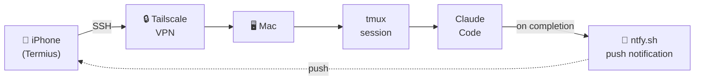

# Mobile Claude Code Setup Guide

> **[한국어 버전 (Korean)](./README.ko.md)**

Access Claude Code from iPhone via SSH (Tailscale + tmux + Termius + ntfy).

## Architecture



## Prerequisites

### Mac
- macOS with Homebrew (`/opt/homebrew`)
- tmux: `brew install tmux`

### iPhone (install from App Store)
- **Termius** — SSH client (free)
- **Tailscale** — VPN access
- **ntfy** — push notifications

### Account
- Tailscale account (Google/GitHub/Apple login) — use same account on both Mac and iPhone

## 1. Enable SSH (Remote Login)

```bash
# Check status
sudo systemsetup -getremotelogin

# Enable (if "Full Disk Access" error, use launchctl instead)
sudo launchctl load -w /System/Library/LaunchDaemons/ssh.plist
```

Verify:
```bash
nc -z localhost 22 && echo "SSH OPEN" || echo "SSH CLOSED"
```

## 2. Install Tailscale

```bash
brew install --cask tailscale
```

> **Note**: Requires sudo. If it fails in Claude Code, run manually in terminal.

- Launch Tailscale app and log in
- Install Tailscale on iPhone (App Store), log in with same account
- Get your Tailscale IP:

```bash
tailscale ip
# Output: 100.x.x.x (use this for Termius)
```

## 3. Install Mosh (Optional)

```bash
brew install mosh
```

> **Known issue**: Mosh breaks Korean input on iOS. We use plain SSH instead.
> Mosh path if needed: `/opt/homebrew/bin/mosh-server`

## 4. Configure tmux

Write `~/.tmux.conf`:

```conf
# 256 color
set -g default-terminal "screen-256color"

# Scrollback buffer
set -g history-limit 50000

# Mouse support (scroll in Termius)
set -g mouse on

# Keep session alive when detached
set -g destroy-unattached off

# Minimal status bar (mobile-friendly)
set -g status-left-length 20
set -g status-right '%H:%M'
```

## 5. Configure ntfy (Push Notifications)

### iPhone
1. Install **ntfy** from App Store
2. Subscribe to topic: `woojin-claude-{hostname}`
   - Check hostname: `hostname -s` (e.g., `Woojinui-Macmini`)
   - Full topic: `woojin-claude-Woojinui-Macmini`

### Mac
Add to `~/.zshrc`:

```bash
# Claude Code with ntfy push notification on completion
ccn() {
  claude "$@"
  curl -s -d "Claude Code 작업 완료" "ntfy.sh/woojin-claude-$(hostname -s)" > /dev/null
}
```

Test:
```bash
curl -d "test" "ntfy.sh/woojin-claude-$(hostname -s)"
# iPhone should receive push notification
```

## 6. Termius Setup (iPhone)

1. New Host:
   - **Hostname**: Tailscale IP (`100.x.x.x`)
   - **Port**: 22
   - **Username**: your mac username
   - **Password**: Mac login password
   - **Mosh**: OFF (Korean input breaks with Mosh ON)

## Usage

### Start session (Mac):
```bash
tmux new -s claude
claude
# Ctrl-b d to detach (or just leave)
```

### Connect from iPhone:
```bash
# Open Termius, connect to host
tmux attach -t claude
# Session resumes exactly where you left off
```

### With ntfy notification:
```bash
ccn "your prompt here"
# Push notification sent when Claude Code finishes
```

### Reconnect after disconnect:
```bash
tmux attach -t claude
# tmux keeps the session alive even if SSH disconnects
```

## Known Issues

| Issue | Cause | Workaround |
|-------|-------|------------|
| Korean input broken in Claude Code | [iOS IME bug](https://github.com/anthropics/claude-code/issues/15705) | Type in Notes app, paste into terminal |
| Korean input broken with Mosh | Mosh locale/IME handling | Use plain SSH (Mosh OFF) |
| `mosh-server: command not found` | Homebrew path not in SSH PATH | Set server path to `/opt/homebrew/bin/mosh-server` in Termius |
| SSH `connection refused` | Remote Login not enabled | `sudo launchctl load -w /System/Library/LaunchDaemons/ssh.plist` |
| `brew install --cask tailscale` fails | Needs sudo | Run manually in terminal, not via Claude Code |

## Tested Environment

- macOS 26.3 (Apple Silicon, Mac mini)
- tmux 3.6a
- Mosh 1.4.0 (installed but not used due to Korean input issue)
- Termius (iOS, free plan)
- Tailscale 1.94.2
- Date: 2026-02-22
